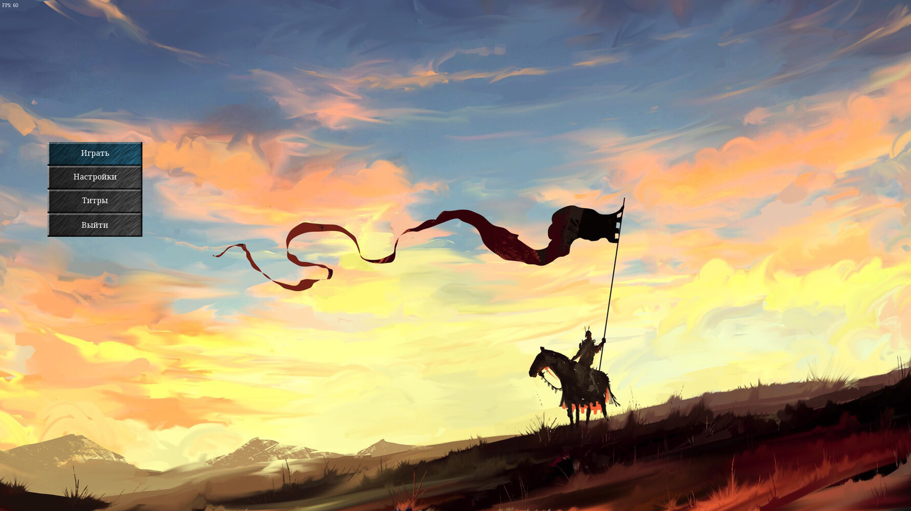
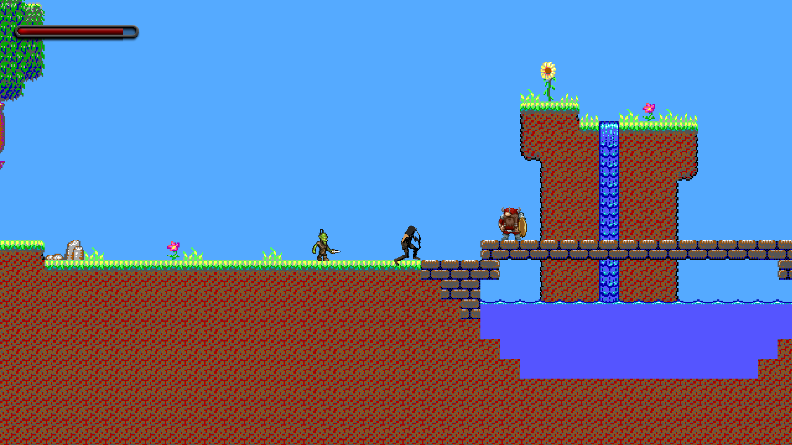
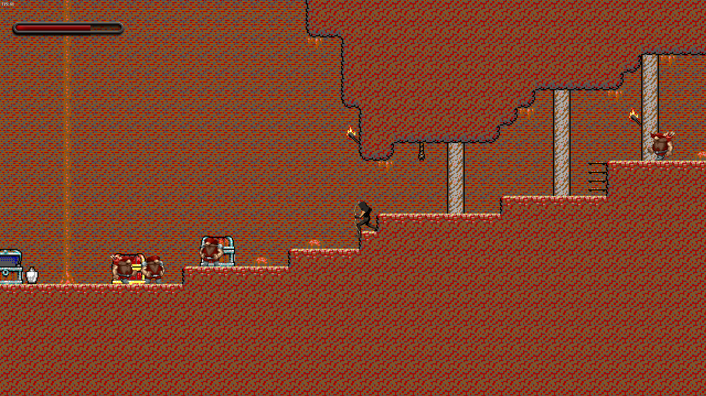
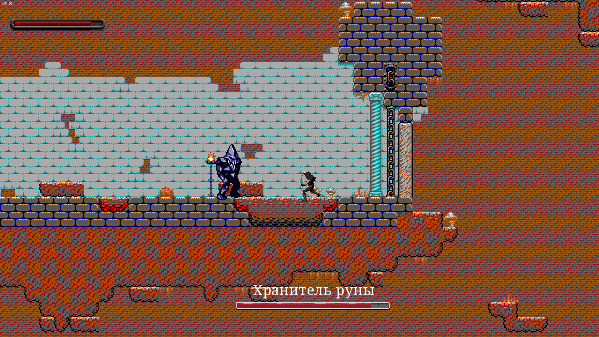

# TIMLE

[![AppVeyor]](https://img.shields.io/appveyor/ci/Vasar007/TIMLE.svg)

Official repository of the game "This Is My Last Escapade" (TIMLE).

## Screenshots

| Main menu                                                          |
|--------------------------------------------------------------------|
|         |

| In game — in the meadow                                            |
|--------------------------------------------------------------------|
| |

| In game — in the cave                                              |
|--------------------------------------------------------------------|
|     |

| In game — fight with Golem                                         |
|--------------------------------------------------------------------|
|   |

| In game — fight with Shadow                                        |
|--------------------------------------------------------------------|
| |

## Download

TinyXML site is [here](http://www.grinninglizard.com/tinyxml/).

Tiled Map Editor used to create levels. Official site is [here](https://www.mapeditor.org/).

SFML library site is [here](https://www.sfml-dev.org/). Its repository can be found [here](https://github.com/SFML/SFML).

## Compiling

This project needs in SFML v2.5.1 and C++17.

## License information

This project is licensed under the terms of the [Apache License 2.0](LICENSE).
