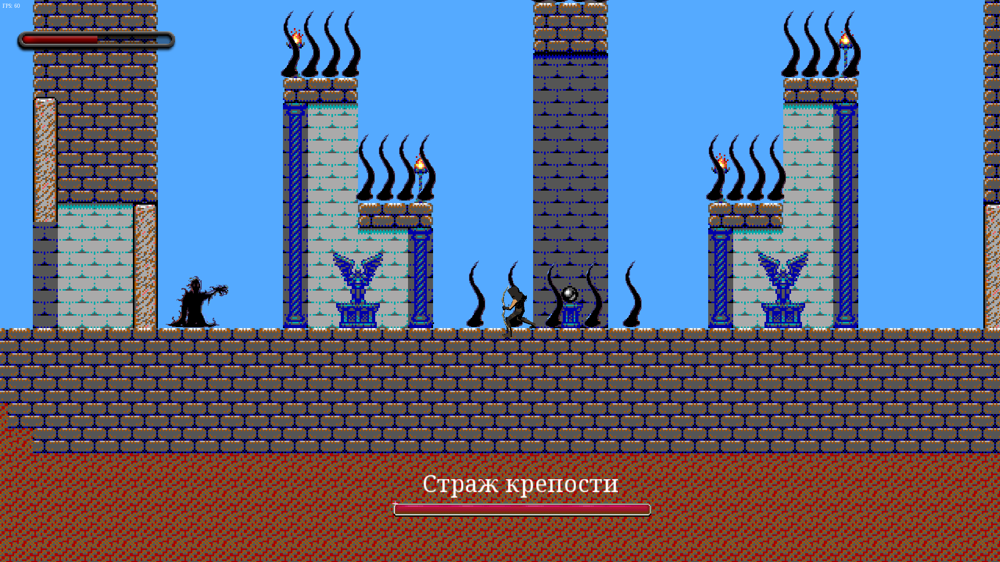

# TIMLE
Official repository of the game "This Is My Last Escapade" (TIMLE).

## Screenshots

| Main menu                                                          |
|--------------------------------------------------------------------|
|         |

| In game — in the meadow                                            |
|--------------------------------------------------------------------|
| |

| In game — in the cave                                              |
|--------------------------------------------------------------------|
|     |

| In game — fight with Golem                                         |
|--------------------------------------------------------------------|
|   |

| In game — fight with Shadow                                        |
|--------------------------------------------------------------------|
| |

## Download

Compiled game file with SFML dlls can be found [here](https://github.com/Vasar007/TIMLE/tree/master/ReleaseWithoutConsole).

## Compiling

This project needs in SFML v2.4 and C++14.

## License information

This project is licensed under the terms of the [MIT License](LICENSE).\
SFML is licensed under the terms of the [zlib/png license](https://www.sfml-dev.org/license.php).
